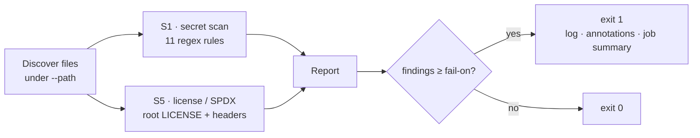

<p align="center">
  
</p>

<h1 align="center">SlopGuard</h1>

<p align="center"><strong>Catch AI-generated slop before it ships.</strong></p>

<p align="center">
  <a href="https://github.com/SarvarUrinboyev/slopguard/actions/workflows/slopguard.yml"></a>
  <a href="https://github.com/SarvarUrinboyev/slopguard/actions/workflows/slopguard.yml"></a>
  
  
  <a href="LICENSE"></a>
  = 18">
</p>

---

A **zero-dependency** security gate — CLI **and** GitHub Action — that fails your build when AI-generated code commits the two mistakes humans miss in review: **leaked secrets** and **missing license/SPDX headers**. **11 secret-detection rules**, **2 checks**, **13 tests** (all green), **~400 LOC**, no `node_modules`. Drop it into CI in three lines.

```text
slopguard — AI slop guard
==========================================
x  [S1 secret scan] src/config.js:2 — Possible AWS Access Key ID committed to source (rule aws-access-key-id). Add "slopguard-ignore" if intentional.
x  [S1 secret scan] src/config.js:3 — Possible OpenAI API key committed to source (rule openai-key). Add "slopguard-ignore" if intentional.
------------------------------------------
Total: 2 issue(s) [S1=2]   →  exit 1
```
<sub>↑ real output from <code>node bin/slopguard.js</code> on a file with two planted (fake-valued) keys.</sub>

## Why

AI coding assistants paste plausible-looking code fast — and that code routinely carries a hard-coded API key or ships a `src/` with no license header. Both pass a quick human skim and fail an audit. SlopGuard makes them **fail the build instead**, with zero supply-chain surface of its own (no dependencies to vet).

## What it checks

| Check | Name | Flags |
| :---: | ---- | ----- |
| **S1** | Secret scan | AWS (key id + secret), GitHub (PAT, fine-grained PAT, OAuth), Anthropic, OpenAI, Slack, Google API, Stripe secret keys, and `BEGIN … PRIVATE KEY` blocks — **11 rules**. |
| **S5** | License / SPDX | A missing root `LICENSE`, and any file under `src/` lacking an `SPDX-License-Identifier:` header in its first 15 lines. |

## How it works



Findings surface three ways: the step **log**, inline **annotations** (`::error file=…,line=…::`), and the **job summary**.

## Use as a GitHub Action

```yaml
# .github/workflows/slopguard.yml
name: slopguard
on: [pull_request]
permissions:
  contents: read
jobs:
  slopguard:
    runs-on: ubuntu-latest
    steps:
      - uses: actions/checkout@v4
      - uses: SarvarUrinboyev/slopguard@v0
        with:
          path: '.'         # root to scan
          src-dir: 'src'     # dir checked for SPDX headers
          fail-on: 'error'   # error | warning | never
```

## Use locally (CLI)

```bash
node bin/slopguard.js --path . --src-dir src --fail-on error
# or, once published to npm:
npx slopguard --path .
```

## Options

| Option | Default | Meaning |
| ------ | ------- | ------- |
| `--path` / `path` | `.` | Root directory to scan. |
| `--src-dir` / `src-dir` | `src` | Directory checked for SPDX headers (S5). |
| `--fail-on` / `fail-on` | `error` | Severity that fails the run: `error`, `warning`, or `never`. |

## Suppressing false positives

Add `slopguard-ignore` anywhere on a line to skip it for the secret scan. Obvious placeholders (`EXAMPLE`, `YOUR_…`, `<your-…>`, `xxxx`, `redacted`) are skipped automatically.

## Develop

```bash
npm test   # node --test  → 13 tests
```

## Roadmap

- [x] **S1** secret scan · **S5** license/SPDX (shipped)
- [ ] Publish to the GitHub Marketplace + npm (`npx slopguard`)
- [ ] **S2–S4**: hallucinated-dependency check, oversized-diff guard, TODO/placeholder-comment gate
- [ ] SARIF output for the GitHub Security tab

## Security

See [SECURITY.md](SECURITY.md) for the responsible-disclosure policy.

## License

[MIT](LICENSE) — © Sarvar Urinboyev.
